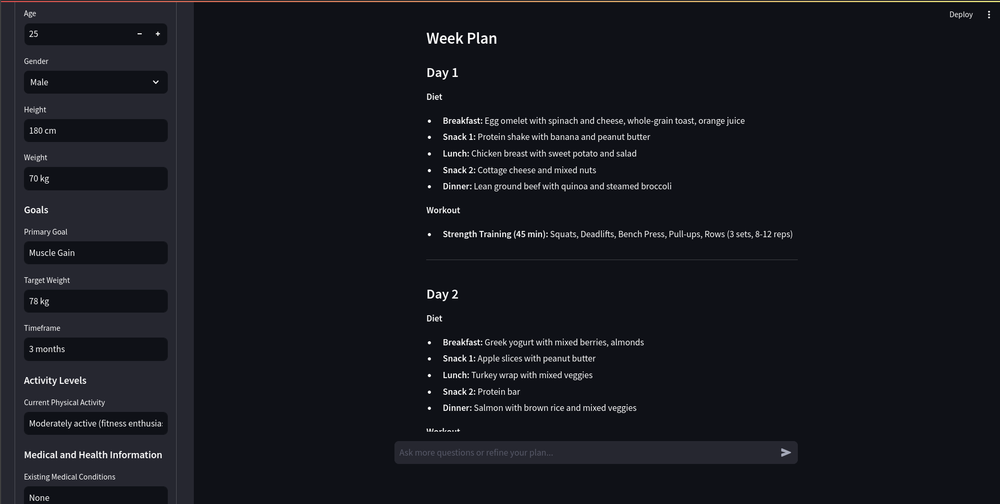

# FitFusion 
## (Diet and Workout Planner)

## **Introduction**
FitFusion is an AI-powered application that generates personalized 7-day diet and workout plans based on user inputs such as age, gender, fitness goals, dietary preferences, and lifestyle habits. The system uses Phidata, LangChain, OpenAI embeddings, and a Weaviate vector store to retrieve relevant information and provide detailed, step-by-step plans.

---

## **Features**
- **Personalized Plans**: Tailors diet and workout schedules to user-specific goals and preferences using Sqlite memory.
- **Knowledge Base Integration**: Utilizes a vector store (Weaviate) to fetch and store knowledge for accurate responses.
- **Multi-agent System**: Combines multiple AI agents for data retrieval and web searching using Phidata.
- **Interactive UI**: A Streamlit-based user interface for seamless interaction and customization.
- **Dynamic Adjustments**: Allows users to modify inputs and receive updated plans instantly.

---

## **Prerequisites**
1. **Docker**: To run the Weaviate vector store.
2. **Python 3.8+**: For the FitFusion codebase.
3. **Virtual Environment (Optional)**: Recommended to manage dependencies.

---

## **Installation**
1. Clone the repository:
   ```bash
   git clone https://github.com/your-repo/fitfusion.git
   cd fitfusion
   ```
2. Create a virtual environment and activate it (optional):
   ```bash
   python -m venv venv
   source venv/bin/activate  # Linux/Mac
   venv\Scripts\activate  # Windows
   ```
3. Install the required dependencies:
   ```bash
   pip install -r requirements.txt
   ```
4. Set up environment variables for API keys in a `.env` file or export them directly:
   ```bash
   OPENAI_API_KEY=your_openai_api_key
   COHERE_API_KEY=your_cohere_api_key
   LANGCHAIN_API_KEY=your_langchain_api_key
   LANGSMITH_API=your_langsmith_api_key
   LANGCHAIN_ENDPOINT=https://api.smith.langchain.com
   ```

---

## **Initializing Weaviate**
1. **Run Weaviate with Docker**:
   - Create a `docker-compose.yml` file with the following content:
     ```yaml
     version: '3.4'
     services:
       weaviate:
         image: semitechnologies/weaviate:latest
         ports:
           - "8080:8080"
         environment:
           - QUERY_DEFAULTS_LIMIT=100
           - AUTHENTICATION_ANONYMOUS_ACCESS_ENABLED=true
           - PERSISTENCE_DATA_PATH=/data
           - DEFAULT_VECTORIZER_MODULE=text2vec-openai
           - OPENAI_APIKEY=your_openai_api_key
         volumes:
           - ./weaviate_data:/data
     ```
   - Start Weaviate:
     ```bash
     docker-compose up -d
     ```
   - Verify it is running at `http://localhost:8080`.

---

## **Running the Application**
1**Start the Streamlit UI**:
   - Launch the Streamlit interface:
     ```bash
     streamlit run app.py
     ```
   - Interact with the app at `http://localhost:8501`.

---

## **How It Works**
1. **Knowledge Base Creation**:
   - FitFusion uses a knowledge base built on Weaviate with OpenAI embeddings to store and retrieve data.
   - Relevant data files (e.g., `.txt`) are loaded from the `./diet_data` directory.

2. **Multi-agent Framework**:
   - A team of agents (e.g., diet planner and web searcher) collaborates to fetch, retrieve, and generate responses.

3. **Interactive Customization**:
   - Users provide personal details, preferences, and goals via the Streamlit UI.
   - The AI dynamically generates a detailed diet and workout plan tailored to the user's input.

---

## **Example Usage**
- Update personal details in the sidebar form.
- Click the "Generate Diet & Workout Plan" button to create a 7-day plan.
- Ask follow-up questions or refine the plan using the chat interface.



---

## **Development and Debugging**
- Restart the Streamlit session using the "New Chat Session" button if needed.
- Modify or add knowledge files in the `./diet` directory and restart the app to reload data.

---

Enjoy building healthier habits with FitFusion! 🚀
